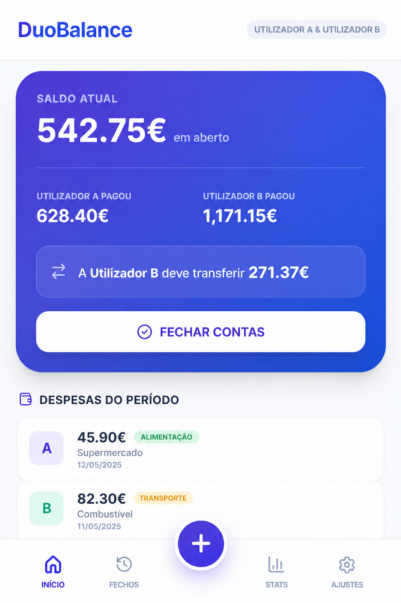

# DuoBalance 💰

A simple web application designed to manage shared expenses between two people, track who paid what, calculate the current balance, and keep a history of settled periods.



## 🤖 AI-First Development

**This project was developed almost entirely with AI.**

The initial idea, product concept, desired behaviour, UX direction and technical requirements were defined by me. The implementation itself was generated almost entirely through AI-assisted development.

My role was primarily focused on:

- Defining the product idea and requirements
- Designing the desired user experience
- Breaking the problem into features and technical requirements
- Prompt engineering and providing detailed guidance to the AI
- Reviewing generated solutions
- Identifying issues and edge cases
- Iteratively refining the implementation until it matched the intended behaviour

The purpose of this project was therefore not to demonstrate traditional manual coding ability, but to explore **how effectively a software product can be designed, iterated and delivered using AI as the primary implementation tool**.

This README intentionally makes that distinction explicit: **the idea and product direction were human-driven, while most of the implementation was AI-generated.**

---

## 🎯 What is DuoBalance?

DuoBalance is a lightweight expense-sharing application for couples or two people who regularly share expenses.

It allows users to:

- Add and remove expenses
- Associate expenses with categories
- Track how much each person has paid
- Automatically calculate the balance between both users
- Identify who owes money and how much
- Close and settle an expense period
- Keep a history of previous settlements
- Revert a previous settlement
- Analyse spending through statistics
- Manage expense categories
- Reset the application data

The application is designed around the idea of keeping the interaction simple while maintaining enough historical information to understand previous spending periods.

---

## 🏗️ Architecture

```text
                     DuoBalance
                         │
             ┌───────────┴───────────┐
             │                       │
          Frontend                Backend
             │                       │
      React + TypeScript       Netlify Functions
             │                       │
             └───────────┬───────────┘
                         │
                         ▼
                    PostgreSQL
                      (Neon)
```

### Frontend

The frontend is built with:

- React
- TypeScript
- Vite
- Lucide React

The application maintains its UI state on the client and communicates with the backend through HTTP API endpoints.

The interface includes the main expense view, historical settlements, statistics and settings.

### Backend

The backend is implemented using **Netlify Functions**.

The API provides endpoints for:

- Retrieving application data
- Creating expenses
- Deleting expenses
- Creating settlement batches
- Reverting settlements
- Creating categories
- Deleting categories
- Resetting application data

The backend uses `@netlify/neon` to communicate with the PostgreSQL database.

### Database

The application persists:

- Expenses
- Categories
- Settlement batches

Expenses can either belong to the currently open period or be associated with a historical settlement batch.

---

## 💡 Core Business Logic

The main calculation determines how much each person has paid during the current open period.

The application calculates:

```text
Total paid by Person A
Total paid by Person B
        │
        ▼
Difference
        │
        ▼
Amount required to settle
```

The amount required to settle is calculated as half of the difference between the two contributions, allowing the application to identify who should transfer money to whom.

When a period is closed, its expenses are moved into a settlement batch while the next period starts with an empty active expense list.

Historical batches can subsequently be inspected or reverted.

---

## 📊 Statistics

The application provides statistics at multiple levels:

- Current open period
- Individual historical settlements
- Overall historical spending

Statistics include total expenditure, payer distribution and category breakdowns.

This allows the application to evolve from a simple expense tracker into a lightweight historical spending analysis tool.

---

## 🛠️ Technology Stack

| Technology | Purpose |
|---|---|
| **React** | Frontend UI |
| **TypeScript** | Application development |
| **Vite** | Frontend tooling and development server |
| **Lucide React** | UI icons |
| **Netlify Functions** | Serverless backend |
| **PostgreSQL / Neon** | Persistent data storage |
| **AI-assisted development** | Primary implementation approach |

---

## 🚀 Running Locally

### Prerequisites

- Node.js
- A PostgreSQL/Neon database
- Required environment variables

Install dependencies:

```bash
npm install
```

Configure the required environment variables, including the database connection.

Start the development server:

```bash
npm run dev
```

---

## 🧠 Why This Project?

The interesting part of DuoBalance is not the complexity of the application itself.

The project was deliberately used as an experiment in **AI-first software development**:

> How far can a product be taken when the human focuses primarily on defining the problem, requirements, UX and desired behaviour, while AI performs most of the implementation?

The development process was therefore highly iterative. Instead of manually writing the application from scratch, I used prompt engineering to continuously provide context, constraints, corrections and desired changes to the AI.

This approach also required reviewing generated code, identifying implementation problems and refining the prompts when the output did not match the intended architecture or behaviour.

The project demonstrates a practical workflow where **human product thinking and technical direction are combined with AI-generated implementation**.

---

## 📌 Project Status

This is an experimental/personal project focused primarily on exploring AI-assisted product development and rapid application prototyping.

The architecture is intentionally lightweight and appropriate for the scope of the application rather than designed as a large-scale production system.
